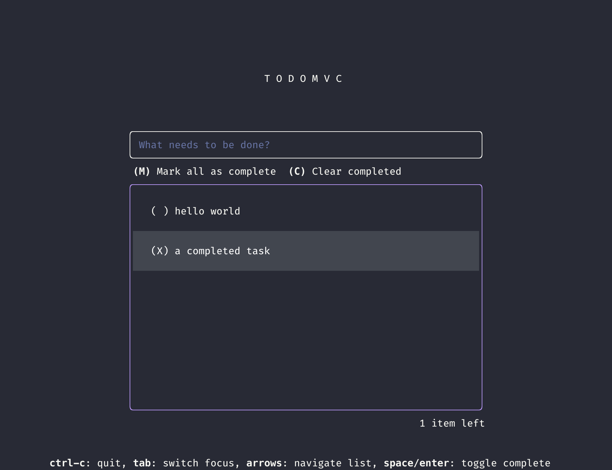

# TodoMVC in the terminal

## Implementations

- Go
  - [x] tview

  - gocui

    Supports adding and toggling

  - (planned) bubbletea

- Rust

  - [x] ratatui

    fully featured except mouse support and a "proper" modal UI for editing

  - (planned) cursive, possibly

- Zig, but as it stands right now the ecosystem is limited.

- Lua (but written with Fennel, probably)
  - (planned) ltui
  - (planned) a C lib with bindings

- Nim
  - (planned) illwill

- C
  - (planned) ncurses, possibly

- Python
  - [x] Textual

    Does not have buttons for "mark all as completed" etc because I can't figure
    out how to have single-row buttons in textual, and using keybindings to do
    these operations instead is boring and trivial.

  - (probably not) urwid, curses

- (planned) Some lisps, hopefully.

- JS/TS
  - (planned) react-ink, probably.
  - (planned) solid-ink

- (planned) shell - bash or maybe even nushell.

- (planned) haskell

## Spec

(loosely formatted)

Implementations marked with `[x]` are deemed "complete". They should satisfy
_most_ of the requirements as listed below, in two or three areas more so,
possibly because the framework/library used provides certain functionality out
of the box.

### code

- All code should be in a single file unless required otherwise by the
  toolchain, in which case, stick to as little code splitting as possible for ease
  of comparison. The single file should be named `main.<ext>` unless required
  otherwise by the toolchain.
- Tests may be added, and may or may not be in the same file
- Documentation on functions may be added
- A binary, if produced, or a project name if required, should be named
  "todomvc-tui"
- directories are named by the framework/library used that does the primary
  heavy-lifting for the terminal, optionally prefixed with the language file
  extension for disambiguation, e.g. "lua-ncurses" for an implementation using the
  famous ncurses library, but with lua bindings.

### functionality

- Show N incomplete as text
- Button to confirm edit with modals
- Input validation - must be non-empty string (whitespace trimmed)
- Button to clear all completed
- Button to mark all completed

### UI

- Solid borders for input and todolist.
- Hero with large padding top/bottom
- Center main section except key hints
- main section max-width 100
- New todo: height (excl borders) 3
- N items left, right aligned under the todolist

### UX

- Keys to navigate
- Keys to toggle complete
- `e` to edit
- optionally key to delete
- Mouse to switch focus
- Input field should support basic emacs keys, optionally mouse support
- Scrollable list view
